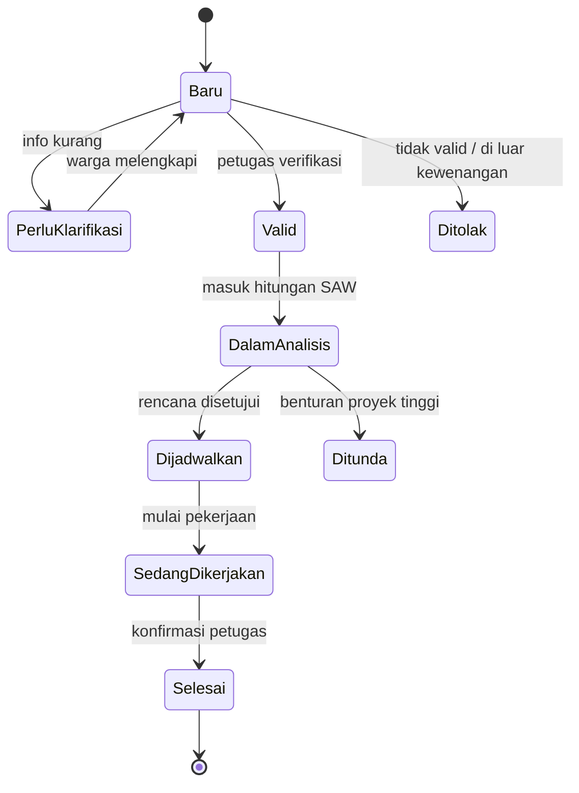

# Rencana Proyek

## SPK Prioritas dan Penjadwalan Perbaikan Jalan Berbasis Laporan Warga
### dengan Analisis Konflik Proyek Aktif dan Pencarian Rute Alternatif Otomatis

---

## 1. Ringkasan Proyek

| Item | Keterangan |
|---|---|
| **Nama sistem** | JalanTanggap (usulan nama aplikasi) |
| **Instansi** | Dinas PUPR (pengguna: bidang bina marga, pengawas lapangan, pengelola pekerjaan) |
| **Jenis sistem** | Sistem Pendukung Keputusan (DSS/SPK) berbasis web dengan dukungan LLM, workflow, dan peta |
| **Sumber masukan utama** | Laporan/aspirasi warga tentang kerusakan jalan |
| **Keluaran utama** | Peringkat prioritas perbaikan, rekomendasi waktu pengerjaan, analisis potensi kemacetan, dan rute alternatif otomatis |
| **Batas geografis** | Satu kecamatan/kelurahan kawasan studi pada tahap prototipe |

### 1.1 Masalah
1. Warga melaporkan jalan rusak dalam bentuk teks bebas yang sering tidak lengkap atau duplikat.
2. Penentuan jalan yang diperbaiki lebih dahulu belum selalu berdasarkan kriteria yang terdokumentasi.
3. Waktu pengerjaan belum mempertimbangkan dampak terhadap aktivitas masyarakat (sekolah, pasar, fasilitas kesehatan).
4. Belum ada perbandingan antara rencana pekerjaan baru dan pekerjaan yang sedang berjalan, sehingga pengalihan kendaraan dapat menumpuk di jalan yang sama dan memicu kemacetan.
5. Penyusunan jalur pengalihan masih manual.

### 1.2 Tujuan
1. Menampung laporan warga dan membantu petugas mengelolanya (klasifikasi, klarifikasi, deteksi duplikasi).
2. Memberikan peringkat prioritas ruas jalan yang perlu diperbaiki berdasarkan kriteria dan bobot yang disepakati.
3. Membandingkan opsi waktu pengerjaan dengan aktivitas sekitar dan pekerjaan aktif.
4. Menilai potensi kemacetan berdasarkan konflik jadwal, tumpang tindih rute pengalihan, dan beban lalu lintas.
5. Mencari rute alternatif otomatis pada peta ketika segmen jalan ditutup/dibatasi.

### 1.3 Prinsip
- **Manusia tetap pengambil keputusan.** Sistem memberi rekomendasi dan alasan; keputusan akhir oleh petugas/pejabat.
- **Dapat dijelaskan.** Setiap rekomendasi dapat ditelusuri ke data dan aturan yang digunakan.
- **LLM tidak menebak data.** Volume kendaraan, kapasitas jalan, dan kondisi teknis berasal dari data, bukan tebakan AI.
- **Prioritas kebutuhan dan kelayakan pelaksanaan ditampilkan terpisah.** Jalan bisa sangat mendesak diperbaiki tetapi sulit ditutup saat ini.

---

## 2. Ruang Lingkup

### 2.1 Termasuk (in-scope) — Prototipe
- Formulir laporan warga (teks, foto, pin peta).
- Pengolahan laporan oleh LLM: ekstraksi informasi, pertanyaan klarifikasi, saran penggabungan laporan serupa.
- Verifikasi laporan oleh petugas.
- DSS prioritas perbaikan dengan metode SAW (kriteria dan bobot terdokumentasi).
- Pencatatan pekerjaan aktif beserta periode pembatasan jalan.
- Analisis konflik: tumpang tindih jadwal, rute pengalihan yang beririsan, aktivitas sekitar.
- Perbandingan skenario waktu pengerjaan (sekarang / setelah proyek lain selesai / jam berbeda).
- Pencarian rute alternatif otomatis dari jaringan jalan (OpenStreetMap) dengan segmen tertutup dikeluarkan.
- Indikator risiko konflik lalu lintas (rendah/sedang/tinggi) + perkiraan beban lalu lintas sederhana bila data volume tersedia.
- Workflow verifikasi → persetujuan → penjadwalan → draf pemberitahuan warga → status penyelesaian.

### 2.2 Tidak termasuk (out-of-scope) — Versi awal
- Deteksi kerusakan jalan otomatis dari foto (computer vision).
- Simulasi lalu lintas mikro / prediksi waktu antrean.
- Pengoptimalan rute truk/alat berat.
- GPS pelacakan kendaraan lapangan.
- Integrasi penuh dengan sistem PUPR/Dishub yang sudah ada (cukup ekspor/impor data).
- Cakupan lebih dari satu wilayah studi.

---

## 3. Alur Kerja Sistem

```
Warga melapor → LLM mengekstrak & klarifikasi → petugas verifikasi
     ↓
Pengelompokan laporan serupa → DSS prioritas ruas jalan (SAW)
     ↓
Cek pekerjaan aktif & jadwal pembatasan jalan
     ↓
Analisis dampak aktivitas (sekolah, pasar, faskes)
     ↓
Perbandingan skenario waktu pengerjaan
     ↓
Pencarian rute alternatif otomatis per skenario
     ↓
Analisis potensi konflik lalu lintas & kemacetan
     ↓
Persetujuan rencana oleh petugas/pejabat
     ↓
Draf pemberitahuan warga → pelaksanaan → konfirmasi selesai
```

### Detail setiap tahap

| Tahap | Aktivitas | Aktor |
|---|---|---|
| 1. Pelaporan | Warga mengisi lokasi, foto, deskripsi, dampak | Warga |
| 2. Pengolahan laporan | LLM mengambil informasi penting, menandai informasi kurang, menyusun pertanyaan klarifikasi, menyarankan laporan serupa | Sistem (LLM) |
| 3. Verifikasi | Memeriksa kebenaran lokasi, menilai tingkat kerusakan, menentukan kewenangan jalan | Petugas |
| 4. Prioritas | Menghitung skor dan peringkat ruas jalan | Sistem (SAW) |
| 5. Konteks proyek | Mengumpulkan pekerjaan aktif dan pembatasan jalan pada waktu skenario | Sistem + input petugas |
| 6. Analisis dampak | Memeriksa benturan dengan aktivitas sekitar | Sistem |
| 7. Skenario | Membandingkan opsi waktu pengerjaan yang layak secara teknis | Petugas + Sistem |
| 8. Rute alternatif | Mencari kandidat rute yang menghindari segmen tertutup dan pekerjaan aktif | Sistem (graf jalan) |
| 9. Konflik lalu lintas | Menilai risiko kemacetan dan tumpang tindih pengalihan | Sistem (aturan + data) |
| 10. Persetujuan | Meninjau rekomendasi dan menetapkan rencana | Petugas/pejabat |
| 11. Komunikasi | Menyusun draf pemberitahuan warga, memperbarui status laporan | Sistem (LLM) + Petugas |

---

## 4. Arsitektur Teknologi

| Komponen | Pilihan | Peran |
|---|---|---|
| Frontend (peta & form) | Leaflet + HTML/JS | Pin laporan, tampilan rute, dashboard |
| Backend | Python (FastAPI) | API, logika DSS, workflow |
| Jaringan jalan | OpenStreetMap (OSM) | Sumber graf jalan |
| Pengolahan graf jalan | OSMnx + NetworkX | Membangun graf, mencari rute |
| Pencarian rute | Dijkstra/A* dengan segmen tertutup dikeluarkan | Kandidat rute alternatif |
| DSS prioritas | SAW (Simple Additive Weighting) | Peringkat ruas jalan |
| LLM | Model LLM siap pakai (mis. API) | Ekstraksi laporan, klarifikasi, penjelasan rekomendasi, draf pemberitahuan |
| Workflow | Status/state di backend (n8n opsional) | Alur verifikasi, persetujuan, notifikasi |
| Database | SQLite (prototipe) → PostgreSQL | Penyimpanan data |
| Visualisasi | Grafik jumlah laporan, skor per kriteria, peta konflik | Dashboard |

**Catatan:** Dua fungsi berbeda secara konseptual:
- **LLM** memahami bahasa (laporan, catatan, penjelasan).
- **Algoritma graf jalan** (bukan LLM) yang mencari rute di peta.
- **SAW** yang menghitung peringkat prioritas.
- **Workflow** yang mengatur alur dan status.

---

## 5. Kebutuhan Data

Rincian lengkap ada di dokumen **`Kebutuhan-Data.md`**. Ringkasan kategori:

| Kategori | Ringkasan | Prioritas ketersediaan |
|---|---|---|
| Laporan warga | Lokasi, foto, deskripsi, dampak, status verifikasi | Dibuat lewat sistem (form) |
| Ruas & kondisi jalan | Geometri, kewenangan, tingkat kerusakan, panjang rusak | Data PUPR / verifikasi petugas |
| Jaringan jalan | Simpul, segmen, panjang, arah, pembatasan akses | OpenStreetMap + verifikasi |
| Aktivitas sekitar | Lokasi & jadwal sekolah, pasar, faskes | Pendataan manual / konfirmasi pengelola |
| Rencana pekerjaan | Segmen, durasi, opsi waktu, jenis penutupan | Petugas teknis |
| Pekerjaan aktif | Segmen, periode, rute pengalihan yang dipakai | Pengawas proyek / PUPR |
| Lalu lintas dasar | Volume per jam, arah, jam sibuk | Dishub / survei sederhana |
| Aturan keputusan | Kriteria, bobot, definisi skor, batasan rute | Kesepakatan dengan petugas |

---

## 6. Tahapan dan Jadwal (Usulan 8 Minggu)

| Minggu | Tahap | Keluaran |
|---|---|---|
| 1 | Studi wilayah & penentuan kriteria | Kawasan terpilih, daftar kriteria & bobot awal, daftar segmen jalan |
| 2–3 | Persiapan data | Jaringan jalan diunduh & dibersihkan, form laporan dibuat, pengumpulan laporan sampel |
| 4 | Pengembangan inti | Form laporan, ekstraksi LLM, DSS SAW, verifikasi |
| 5 | Pengembangan rute & konflik | Pencarian rute otomatis, data pekerjaan aktif, indikator konflik |
| 6 | Analisis dampak & skenario | Perbandingan waktu pengerjaan, indikator risiko kemacetan |
| 7 | Workflow & komunikasi | Persetujuan, draf pemberitahuan, status penyelesaian |
| 8 | Uji coba & evaluasi | Uji akurasi, demo skenario, dokumentasi & rekomendasi lanjutan |

Jadwal fleksibel; perkiraan ini untuk prototipe dengan satu wilayah dan lingkup terbatas.

---

## 7. Peran dan Tanggung Jawab

| Peran | Tanggung jawab utama |
|---|---|
| **Warga** | Melaporkan kerusakan jalan beserta lokasi dan foto |
| **Petugas verifikasi** | Memvalidasi laporan, menilai kondisi, menentukan kewenangan |
| **Pengawas lapangan/pelaksana** | Menyediakan data durasi, opsi waktu, dan jenis penutupan |
| **Pengelola proyek aktif** | Memperbarui jadwal dan pembatasan jalan |
| **Pejabat/penanggung jawab** | Menyetujui prioritas, jadwal, dan rute pengalihan |
| **Tim teknis sistem** | Membangun, menguji, dan memelihara sistem |
| **Dishub (sesuai kewenangan)** | Konfirmasi rencana pengalihan dan data lalu lintas |

---

## 8. Pengujian dan Evaluasi

### 8.1 Uji fungsional
- Ekstraksi LLM benar (lokasi, jenis keluhan, dampak).
- Peringkat SAW sesuai perhitungan manual.
- Rute menghindari segmen tertutup dan pembatasan akses.
- Konflik proyek terdeteksi saat jadwal bertumpang tindih.

### 8.2 Uji kualitas rekomendasi
- Bandingkan peringkat sistem dengan penilaian petugas PUPR.
- Uji kepekaan: perubahan kecil pada bobot sebaiknya tidak mengubah peringkat secara drastis.
- Validasi rute alternatif di lapangan (jalan bisa dilalui sesuai asumsi).

### 8.3 Indikator keberhasilan

| Indikator | Ukuran |
|---|---|
| Waktu pengolahan laporan | Menurun dibandingkan manual |
| Ketepatan klasifikasi LLM | % cocok dengan kategori manual |
| Validasi DSS | % peringkat sesuai penilaian petugas |
| Deteksi konflik proyek | % konflik nyata yang teridentifikasi |
| Kelayakan rute alternatif | % rute yang dapat dilaksanakan di lapangan |
| Keterlacakan | % rekomendasi yang dapat ditelusuri ke data |

---

## 9. Risiko dan Mitigasi

| Risiko | Dampak | Mitigasi |
|---|---|---|
| Jaringan OSM tidak lengkap (lebar, arah, batasan) | Rute kurang akurat | Tandai "belum diverifikasi"; verifikasi kandidat rute yang dipakai |
| Data lalu lintas tidak tersedia | Tidak bisa memprediksi kemacetan | Gunakan indikator risiko konflik; tampilkan keterbatasan |
| Bobot kriteria subjektif | Peringkat diperdebatkan | Tetapkan bersama petugas & dokumentasikan |
| Duplikasi laporan | Jumlah laporan bias | Deteksi kedekatan koordinat + konfirmasi penggabungan |
| LLM salah memahami laporan | Data salah | Keluaran LLM selalu diverifikasi petugas sebelum dipakai |
| Pin peta warga tidak akurat | Salah menautkan ke segmen | Verifikasi; gunakan segmen terdekat sebagai saran, bukan keputusan |

---

## 10. Keluaran Akhir Proyek

1. Dokumen perencanaan ini dan kebutuhan data.
2. Aplikasi prototipe yang bisa didemonstrasikan.
3. Data uji coba (laporan, segmen, proyek aktif).
4. Dokumentasi cara kerja, asumsi, dan keterbatasan.
5. Laporan evaluasi + rekomendasi pengembangan lanjutan.

---

## LAMPIRAN. RENCANA KERJA OPERASIONAL

> Bagian ini melengkapi Bab 6 (Jadwal) menjadi rencana kerja yang siap dieksekusi: rincian tugas, pemetaan data ke tiap fase, spesifikasi modul, desain metode, alur status, prompt LLM, dan kriteria penerimaan.

## 11. Rincian Rencana Kerja (WBS)

| Kode | Tugas | Output / Definition of Done | Minggu |
|---|---|---|---|
| 1.1 | Pemilihan kawasan studi | Satu kelurahan/kecamatan ditetapkan, alasan & batas ditulis | 1 |
| 1.2 | Wawancara petugas PUPR | Kriteria prioritas + bobot awal disepakati & didokumentasikan | 1 |
| 1.3 | Identifikasi segmen jalan | 10–20 segmen calon + daftar segmen penghubung terdata | 1 |
| 2.1 | Unduh & bersihkan jaringan jalan OSM | Graf jalan siap pakai (node, edge, atribut arah/lebar) | 2 |
| 2.2 | Bangun form laporan warga | Form teks + foto + pin peta berjalan | 2 |
| 2.3 | Pendataan aktivitas sekitar | Tabel sekolah/pasar/faskes + jam padat terkumpul | 2–3 |
| 2.4 | Kumpulkan laporan sampel | 50–100 laporan (nyata atau simulasi berlabel) | 3 |
| 4.1 | Modul ekstraksi LLM | Laporan → JSON (lokasi, jenis, dampak, info kurang) | 4 |
| 4.2 | Deteksi duplikasi laporan | Kandidat laporan serupa ditandai utk dikonfirmasi | 4 |
| 4.3 | Layar verifikasi petugas | Status laporan berubah; nilai kerusakan tercatat | 4 |
| 4.4 | Mesin SAW prioritas | Peringkat ruas + rincian skor + keterlacakan | 4 |
| 5.1 | Repositori proyek aktif | Segmen, periode, jenis penutupan tersimpan | 5 |
| 5.2 | Pencarian rute otomatis | Rute hindari segmen tertutup & batas akses | 5 |
| 5.3 | Indikator konflik pengalihan | Deteksi tumpang tindih jadwal & rute yang sama | 5 |
| 6.1 | Analisis dampak aktivitas | Skor benturan per opsi waktu | 6 |
| 6.2 | Perbandingan skenario | Tabel opsi waktu + risiko + penjelasan | 6 |
| 6.3 | Estimasi beban lalu lintas* | Beban = dasar + peralihan vs kapasitas (jika data ada) | 6 |
| 7.1 | Workflow persetujuan | Draf → ditinjau → disetujui → dijadwalkan | 7 |
| 7.2 | Penghasil draf pemberitahuan | Teks pengumuman dari rencana disetujui | 7 |
| 8.1 | Uji akurasi & kepekaan | Laporan hasil uji terdokumentasi | 8 |
| 8.2 | Demo skenario end-to-end | Alur laporan→prioritas→rute→pemberitahuan jalan | 8 |

\* Tugas 6.3 opsional; di-skipped bila data lalu lintas tidak tersedia.

## 12. Jadwal per Minggu

| Fase / Minggu | M1 | M2 | M3 | M4 | M5 | M6 | M7 | M8 |
|---|---|---|---|---|---|---|---|---|
| Persiapan & kriteria | ███ | | | | | | | |
| Data & form | | ███ | ███ | | | | | |
| Inti: LLM + SAW | | | | ███ | | | | |
| Rute & konflik | | | | | ███ | | | |
| Dampak & skenario | | | | | | ███ | | |
| Workflow & komunikasi | | | | | | | ███ | |
| Uji, demo, dokumen | | | | | | | | ███ |

## 13. Pemetaan Kebutuhan Data ke Tahapan

| Data | Dibutuhkan sejak | Wajib untuk | Sumber |
|---|---|---|---|
| Jaringan jalan OSM | Minggu 2 | Rute & konflik (5.2) | OSMnx unduh |
| Laporan warga | Minggu 3 | Ekstraksi LLM, prioritas | Form / data PUPR |
| Segmen & kondisi | Minggu 1 (identif.), 4 (nilai) | SAW | Verifikasi petugas |
| Aktivitas sekitar | Minggu 3 | Dampak waktu (6.1) | Pendataan manual |
| Proyek aktif | Minggu 5 | Deteksi konflik | Pengawas/PUPR |
| Lalu lintas dasar | Minggu 6 (opsional) | Estimasi beban (6.3) | Dishub / survei |
| Aturan & bobot | Minggu 1 | Seluruh perhitungan DSS | Kesepakatan petugas |

## 14. Spesifikasi Modul

| Modul | Masukan | Keluaran |
|---|---|---|
| M1. Penerimaan Laporan | Form warga | Rekaman laporan mentah + status Baru |
| M2. Ekstraksi LLM | Teks laporan | JSON terstruktur + daftar info kurang |
| M3. Deteksi Duplikasi | Koordinat + isi laporan | Kandidat gabungan (perlu konfirmasi) |
| M4. Verifikasi | Laporan ter-ekstrak + petugas | Status Valid + nilai kriteria |
| M5. Mesin SAW | Nilai segmen + bobot | Peringkat prioritas + rincian skor |
| M6. Repositori Proyek | Data proyek aktif/terjadwal | Jadwal pembatasan per segmen |
| M7. Pencari Rute | Graf + segmen tertutup + batas | Kandidat rute + tambahan jarak |
| M8. Analisis Konflik | Rute + proyek + aktivitas | Skor risiko rendah/sedang/tinggi |
| M9. Workflow Persetujuan | Rekomendasi | Rencana disetujui + status |
| M10. Komunikasi | Rencana disetujui | Draf pemberitahuan warga |

### Endpoint API inti

```plain text
POST  /laporan                -> terima laporan warga
POST  /laporan/{id}/ekstrak   -> jalankan ekstraksi LLM
POST  /laporan/{id}/verifikasi-> petugas memvalidasi
GET   /prioritas              -> daftar peringkat segmen
GET   /proyek-aktif           -> jadwal pembatasan
POST  /skenario/{segmen}      -> bandingkan opsi waktu pengerjaan
POST  /rute-alternatif        -> cari rute hindari segmen
GET   /konflik?waktu=...      -> risiko kemacetan per waktu
POST  /persetujuan/{id}       -> setujui/tolak rencana
POST  /pemberitahuan/{id}     -> draf pengumuman warga
```

## 15. Desain Metode Analisis

### 15.1 SAW (perhitungan prioritas)

```plain text
1. Susun matriks nilai x[ij] (segmen i, kriteria j)
2. Normalisasi:
   - benefit  : r[ij] = x[ij] / max(i) x[ij]
   - cost     : r[ij] = min(i) x[ij] / x[ij]
3. Skor  V[i] = SUM( w[j] * r[ij] )
4. Peringkat = urutkan V[i] terbesar
```

| Kriteria | Tipe | Bobot contoh | Sumber nilai |
|---|---|---|---|
| Tingkat kerusakan (1–5) | benefit | 0,40 | Verifikasi petugas |
| Dampak akses | benefit | 0,30 | Enum dipetakan 1–4 |
| Peran jalan (fasilitas) | benefit | 0,20 | Observasi |
| Jumlah pelapor valid | benefit | 0,10 | Rekap laporan |
| Lama belum ditangani | benefit | (pendukung) | Riwayat |

Bobot contoh harus dikonfirmasi petugas dan boleh memakai AHP untuk pembobotan lebih formal.

### 15.2 Penilaian risiko konflik (tanpa model lalu lintas)

```plain text
Konflik = 1 jika:
  - waktu pembatasan 2 proyek bertumpang tindih, ATAU
  - rute pengalihan melewati segmen proyek lain, ATAU
  - >=2 pengalihan memakai segmen yang sama, ATAU
  - pengalihan bertepatan jam padat sekolah/pasar
Risiko:
  rendah  : 0 konflik
  sedang  : 1 konflik
  tinggi  : >=2 konflik atau jalan penerima sempit
```

### 15.3 Estimasi beban (opsional, bila ada data volume)

```plain text
Beban_pada_rute  = volume_dasar + volume_peralihan
Rasio_ke_kapasitas = Beban_pada_rute / kapasitas_efektif
Kapasitas_efektif berkurang jika lajur ditutup
Tandai segmen dengan rasio mendekati/melebihi 1 sebagai rawan
Asumsi % peralihan wajib dinyatakan & diuji kepekaan
```

## 16. Alur Status



## 17. Desain Prompt LLM

> Tanpa RAG pada versi awal. Aturan, kategori, dan contoh dikemas langsung di system prompt (context statis). Retrieval sederhana (ambil aturan/template dari DB) opsional. RAG penuh baru dipakai bila LLM harus menjawab dari banyak dokumen SOP/peraturan yang sering berubah.

| Prompt | Tugas | Keluaran wajib | Guardrail |
|---|---|---|---|
| P1 Ekstraksi | Pahami laporan warga | JSON: lokasi, jenis, dampak, info kurang | Jangan mengarang; kosong bila tak jelas |
| P2 Klarifikasi | Susun pertanyaan balik | Daftar pertanyaan singkat | Maks 3 pertanyaan |
| P3 Ringkas | Merangkum laporan 1 lokasi | Ringkasan + rujukan ID | Sertakan sumber |
| P4 Jelaskan | Uraikan alasan rekomendasi | Narasi dari data skor/rute | Angka dari sistem, bukan LLM |
| P5 Umumkan | Draf pemberitahuan warga | Teks sopan + lokasi + jadwal | Hanya dari rencana disetujui |

## 18. Kriteria Penerimaan (Definition of Done)

| Fase | Dinyatakan selesai bila |
|---|---|
| Data | Jaringan jalan termuat; ≥50 laporan; aktivitas sekitar terdata |
| Inti | Ekstraksi cocok ≥80% vs manual; SAW = hitung manual; rute hindari segmen tertutup |
| Rute & konflik | Tidak ada rute melewati batas akses; konflik tumpang tindih terdeteksi pada skenario uji |
| Analisis | Minimal 2 opsi waktu dibandingkan dengan skor & alasan |
| Workflow | Status berubah sesuai alur; draf pemberitahuan terbentuk dari rencana disetujui |
| Evaluasi | Laporan uji akurasi & kepekaan bobot + demo end-to-end berjalan |

## 19. Skenario Demo

1. Warga melapor: "Jalan Melati depan sekolah banyak lubang, pagi macet."
2. LLM mengekstrak: lokasi=Jalan Melati/depan sekolah, keluhan=berlubang, dampak=kemacetan.
3. Petugas verifikasi: kerusakan berat, akses terganggu → Valid.
4. Sistem SAW: Jalan Melati peringkat 1 dengan rincian skor per kriteria.
5. Cek proyek aktif: proyek lain menutup Jalan C → rute pengalihan tumpang tindih.
6. Perbandingan skenario: dikerjakan sekarang vs setelah proyek C selesai, lengkap risiko.
7. Rute alternatif otomatis muncul di peta + tambahan jarak + atribut belum terverifikasi.
8. Petugas menyetujui → sistem menyusun draf pemberitahuan warga.

## 20. Risiko Operasional Tambahan

| Risiko | Dampak | Mitigasi |
|---|---|---|
| Data proyek aktif jarang diperbarui | Konflik terlewat | Pengingat pembaruan di workflow + label kedaluwarsa |
| Lokasi simulasi disalahartikan nyata | Kesimpulan keliru | Tanda "SIMULASI" pada data uji |
| Warga enggan melapor | Cakupan bias | Verifikasi lapangan; jumlah laporan berbobot kecil |
| Batas wilayah studi memotong rute | Rute tidak realistis | Muat jaringan lebih luas dari batas studi |